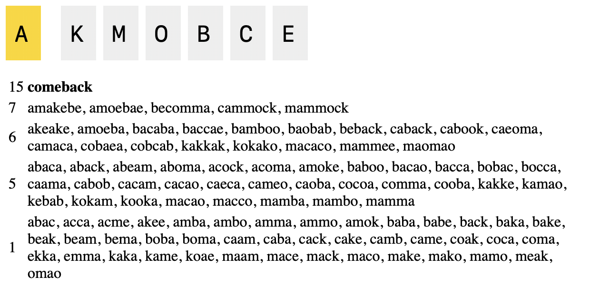

# NYT Spelling Bee Solver

[](https://www.jacobelder.com/2025/04/02/bee_solver.html)

A solver for NYT's irritating but addictive daily word game [Spelling Bee](https://www.nytimes.com/puzzles/spelling-bee).

This uses a slightly larger dictionary than the real game, but the same scoring algorithm. You will get some false positives. 

## Installation for Local Use

```shellsession
$ cargo install bee_solver
$ bee_solver o zntcia
```

## Web

```shellsession
$ cargo install wasm-bindgen
$ wasm-pack build --release --target web
$ python3 -m http.server
$ open http://localhost:8000/
```
